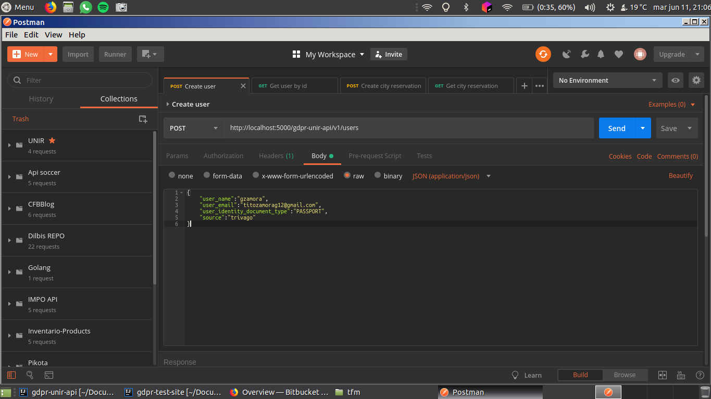
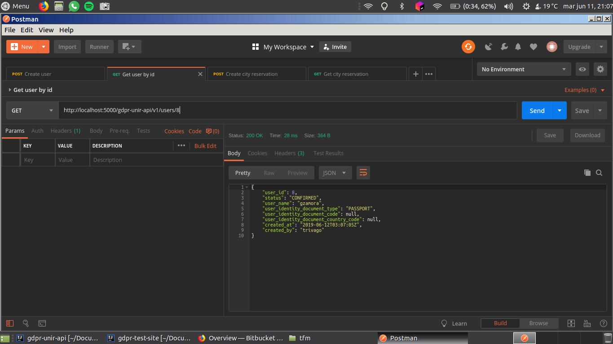
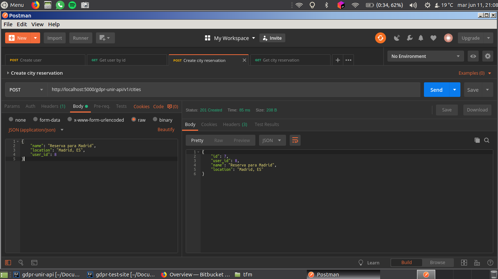
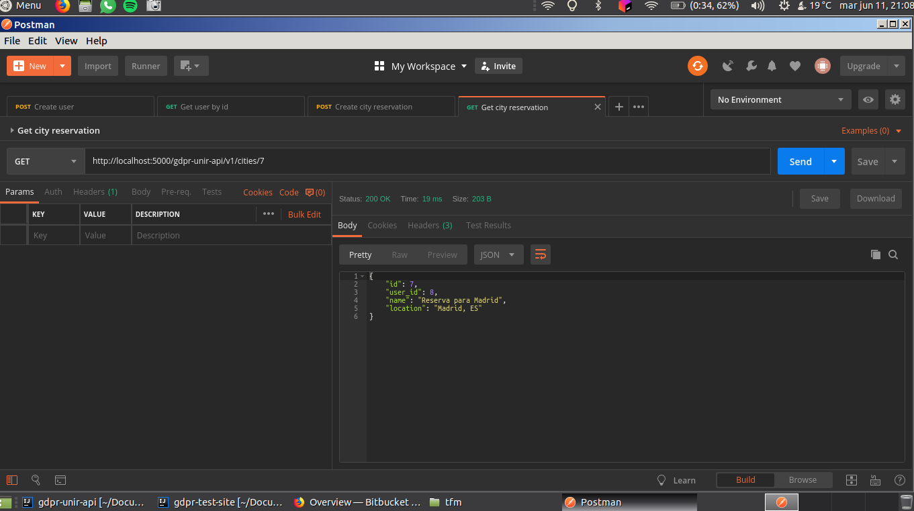
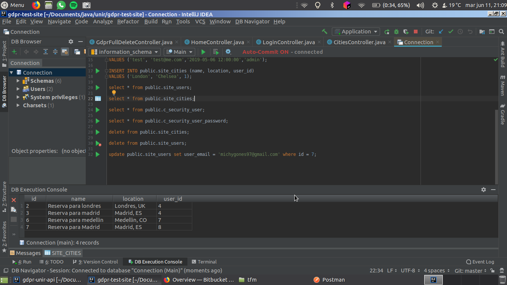
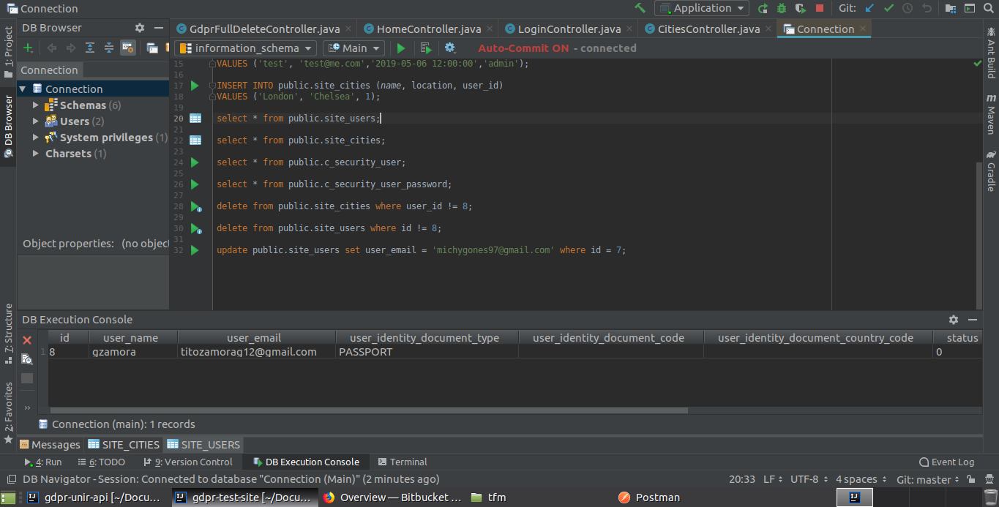
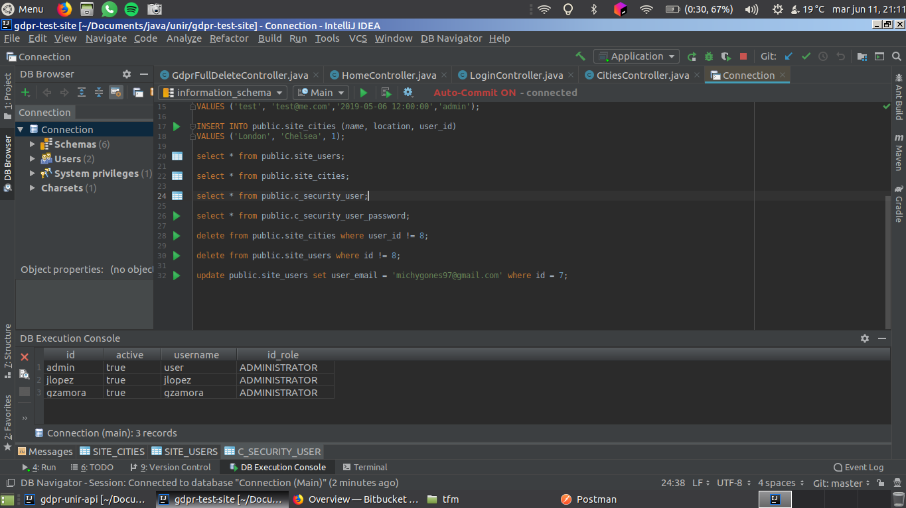

# GDPR UNIR API

The following source code includes the example of an API for a flight's reservation customer using this API to create the user, create reservations, get those data and check and validate if a user doesn't need to continue sending EMAILS.

Screen shots:

## Create a User

## 

## Get a user

## Create a reservation for the user

## Get reservation by user

## 

